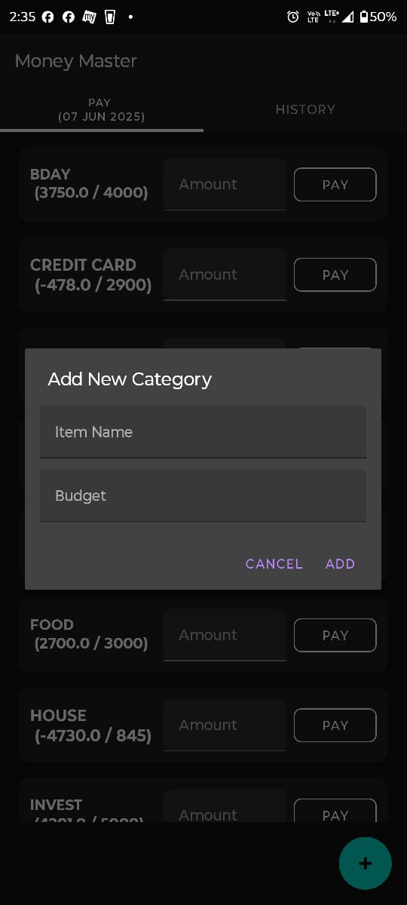

# Money Master - Expense Tracker Android App

A comprehensive budget and expense tracking Android application built with Java and Firebase. This app helps users manage their finances by tracking expenses across different categories with real-time budget monitoring and detailed spending history.

## Features

### 📊 Budget Management
- **Category-based budgeting**: Create and manage expense categories with individual budgets
- **Real-time balance tracking**: Monitor remaining budget balances for each category
- **Budget reset functionality**: Reset all category budgets to their original amounts
- **Balance adjustments**: Automatic budget balance updates when expenses are recorded

### 💰 Expense Tracking
- **Quick payment processing**: Record expenses against specific categories
- **Pay Button**: The Pay button redirects to any supported payment app (e.g., GPay, CRED, PhonePe).
- **Automatic balance deduction**: Budget balances update automatically when payments are made
- **Payment validation**: Prevents invalid transactions and provides error feedback
- **Multi-currency support**: Handle decimal amounts with precision

### 📈 History & Analytics
- **Monthly expense reports**: View spending organized by month and year
- **Daily spending breakdown**: Detailed view of expenses by specific dates
- **Category-wise analysis**: Track spending patterns across different categories
- **Total spending calculations**: Automatic calculation of daily, monthly, and category totals
- **Historical data management**: Edit, update, or delete past expense entries

### 🔄 Data Management
- **Real-time synchronization**: All data synced with Firebase Realtime Database
- **Offline support**: Local data handling with Firebase integration
- **Data persistence**: Reliable storage and retrieval of financial data
- **Backup and restore**: Cloud-based data storage ensures data safety

## 📸 Screenshots

<p align="center">
  
   
  
</p>


## Tech Stack

- **Language**: Java
- **Database**: Firebase Realtime Database
- **Platform**: Android
- **Architecture**: Model-View-Controller (MVC) pattern
- **Storage**: Cloud-based with Firebase

## Firebase Database Structure

```
Money-Planner/
├── Cat_items/                 # Category items and budgets
│   └── [category_name]/
│       ├── name: String
│       ├── budget: String
│       └── budget_balance: String
└── History/                   # Expense history
    └── [month_year]/         # e.g., "January 2024"
        └── [day]/            # e.g., "15"
            └── [entry_id]/
                ├── categoryName: String
                ├── amountPaid: Double
                ├── itemName: String
                └── timestamp: String
```

## Getting Started

### Prerequisites

- Android Studio (latest version recommended)
- Android SDK (API level 21 or higher)
- Google account for Firebase setup

### Installation & Setup

1. **Clone the repository**
   ```bash
   https://github.com/AstinOfficial/MoneyMaster.git
   cd MoneyMaster
   ```

2. **Open in Android Studio**
   - Launch Android Studio
   - Select "Open an existing Android Studio project"
   - Navigate to the cloned repository folder and select it

3. **Firebase Setup**
   
   a. **Create a Firebase Project**
   - Go to [Firebase Console](https://console.firebase.google.com/)
   - Click "Create a project" or "Add project"
   - Enter your project name (e.g., "Money Master")
   - Follow the setup wizard
   
   b. **Add Android App to Firebase**
   - In Firebase console, click "Add app" and select Android
   - Enter your app's package name (found in `app/build.gradle`)
   - Download the `google-services.json` file
   - Place it in the `app/` directory of your project
   
   c. **Enable Realtime Database**
   - In Firebase console, go to "Realtime Database"
   - Click "Create Database"
   - Choose "Start in test mode" for development
   - Select your preferred location

4. **Configure Firebase Rules**
   ```json
   {
     "rules": {
       ".read": "auth != null",
       ".write": "auth != null"
     }
   }
   ```
   
   For testing purposes, you can use:
   ```json
   {
     "rules": {
       ".read": true,
       ".write": true
     }
   }
   ```

5. **Update Dependencies**
   - Sync the project in Android Studio
   - Ensure all Firebase dependencies are properly configured

### Configuration

1. **Customize App Settings**
   - Update app name, package name, and other identifiers as needed
   - Modify Firebase database paths if you want different structure

2. **Test Firebase Connection**
   - Run the app on an emulator or device
   - Verify data is being written to Firebase console

## Usage

### Setting Up Categories
1. Create expense categories (e.g., Food, Transportation, Entertainment)
2. Set budget amounts for each category
3. Monitor remaining balances

### Recording Expenses
1. Select a category
2. Enter the expense amount
3. Add optional item description
4. Click the Pay Button to redirects to any supported payment app (e.g., GPay, CRED, PhonePe).

### Viewing History
1. Navigate to History section
2. Browse by month/year
3. View detailed breakdowns by day or category
4. Edit or delete entries as needed

### Managing Budgets
1. Reset all budgets to original amounts
2. Adjust individual category budgets
3. Monitor spending against budgets


## 📌 Note for Developers

 **This app is designed for personal finance tracking. Always ensure your financial data is secure and backed up appropriately.**

## Contributing

1. Fork the repository
2. Create a feature branch (`git checkout -b feature/new-feature`)
3. Commit your changes (`git commit -am 'Add new feature'`)
4. Push to the branch (`git push origin feature/new-feature`)
5. Create a Pull Request


## 🙋‍♂️ Author
Astin Biju <br>
Feel free to connect on <a href="https://www.linkedin.com/in/astin-biju/">LinkedIn</a> or message me for questions or collaboration.

